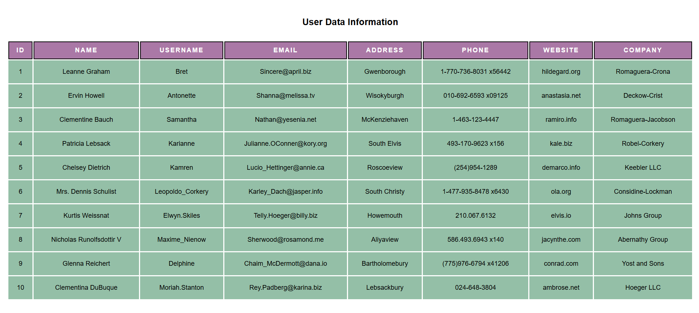
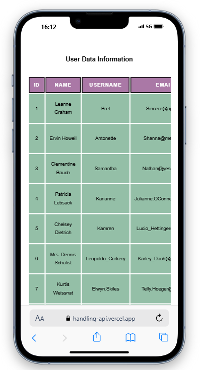

# Aug_Week02
This project repository includes the website that takes data from a certain website named as "jsonplaceholder" and shows the records it gets from that website in a form of table. The main purpose for this website is a learning process to handle api calls and handle the data we get from that into a form of table. This table is made responsive for both mobile and desktop screens. It also includes screen sizes of almost all screens ranges from smallest mobiles screen to bigger desktop screens.

# Web View
    

# Mobile View

# Deployed On:
This website is deployed on both Vercel and Netlify platform. Here are the links given below:

Vercel: https://handling-api.vercel.app/

Netlify: https://handling-api.netlify.app/